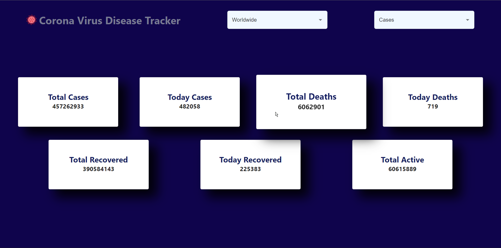
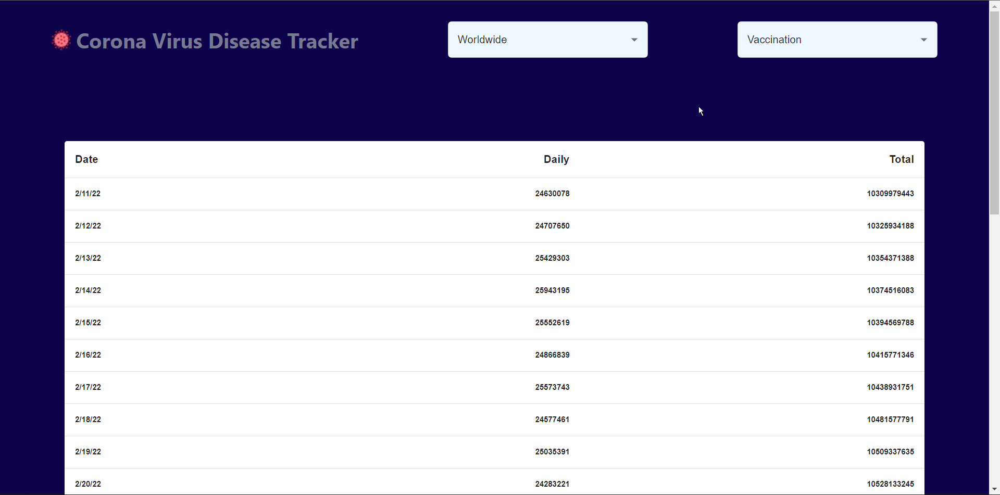

# Corona Virus Disease Tracker

In this you can get latest information of covid cases and the number of doses for Vaccination in the world and country wise.

# Getting Started with Corona Virus Disease Tracker

This project was bootstrapped with [Create React App](https://github.com/facebook/create-react-app).

## Available Scripts

In the project directory, you can run:

### `npm install`

Installs all the required packages and dependencies.

### `npm start`

Runs the app in the development mode.\
Open [http://localhost:3000](http://localhost:3000) to view it in your browser.

The page will reload when you make changes.\
You may also see any lint errors in the console.

